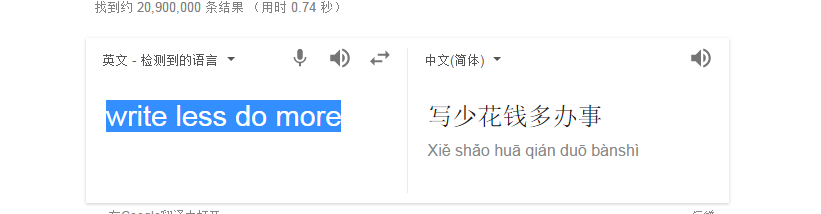

[JQuery技术文档](https://jquery.com/)

# JQuery
# 什么是JQuery?为什么要学它? 
> jQuery is a fast, small, and feature-rich JavaScript library. It makes things like HTML document traversal and manipulation, event handling, animation, and Ajax much simpler with an easy-to-use API that works across a multitude of browsers. With a combination of versatility and extensibility, jQuery has changed the way that millions of people write JavaScript.  

 简单来说
* JQuery是一个敏捷,高效的javascript库
* 便捷的DOM元素操作
* 事件处理
* 封装好的易用的AJAX

# Jquery的口号


* 几行代码,能做大事
* 少写代码,多做事




# 综上所属
jquery是一个javascript库,能让我们写更少的代码,编写更多的功能


## 安装JQuery
```npm
// 安装jquery
npm install jquery --save
// 安装@types/jquery
npm install @types/jquery --save
```


## 什么是DOM元素的操作?
### 第一个jquery程序
* 在src下创建dom.html,并引入 `jquery.js`

```html
<button class="continue">第一步</button>
<script src="node_modules/jquery/dist/jquery.js"></script>
```

```javascript
$( "button.continue" ).html( "Next Step..." )   
```

## 什么是事件处理?
### 第二个应用程序

